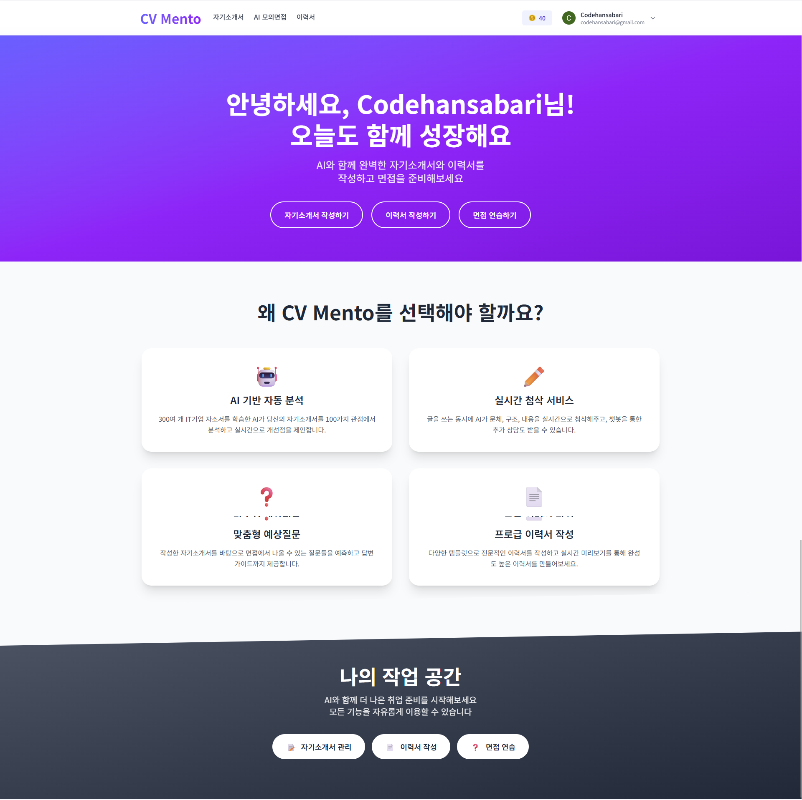
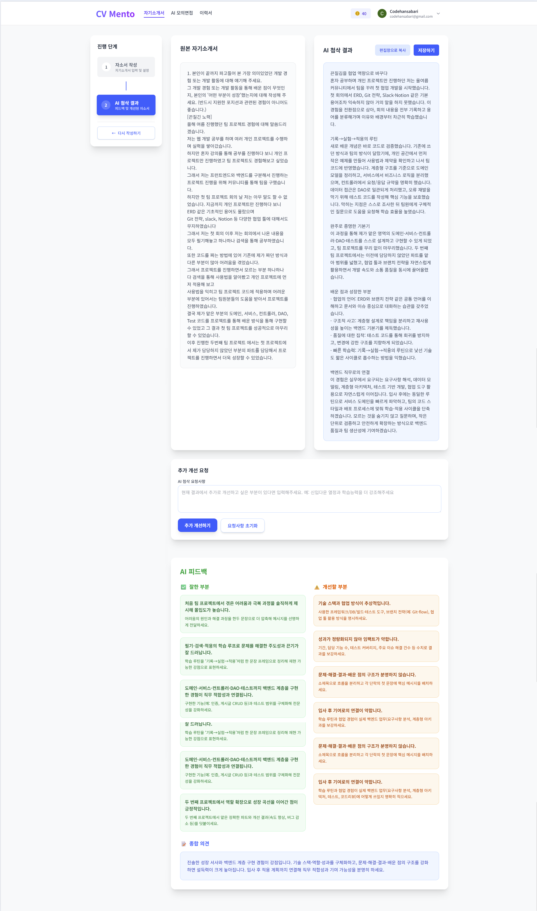
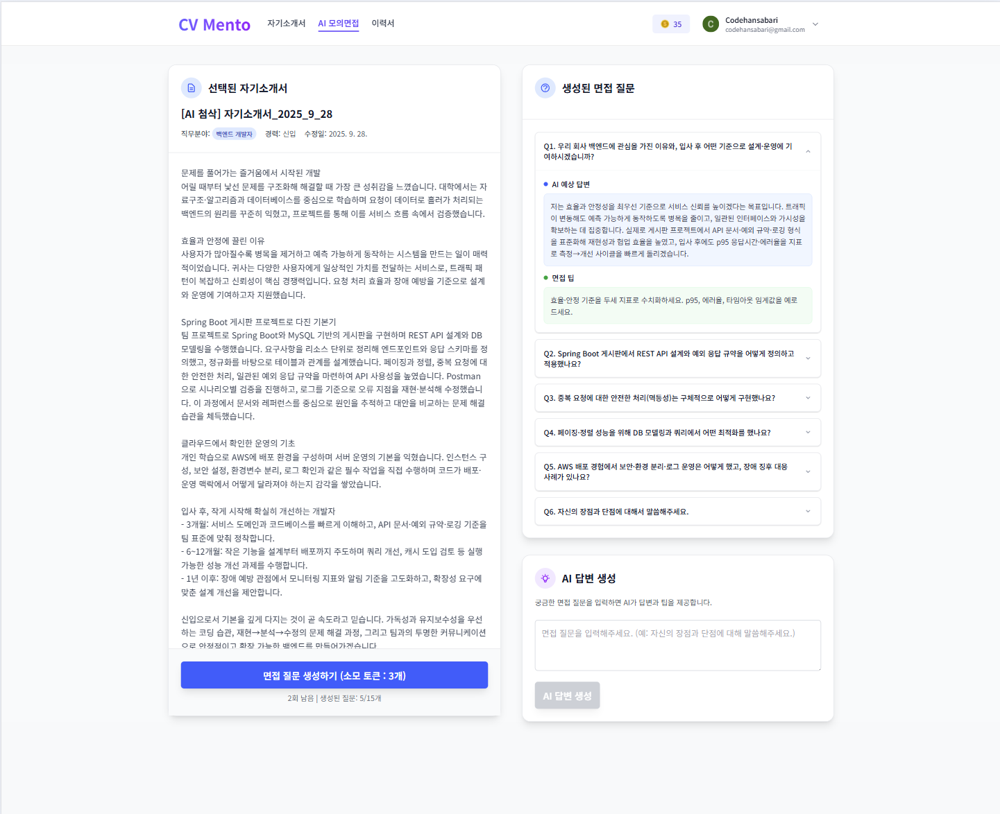
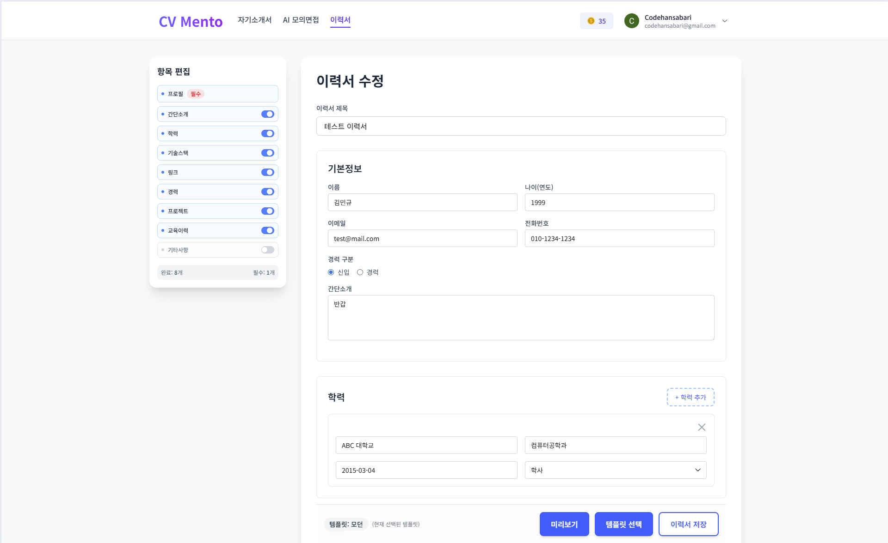
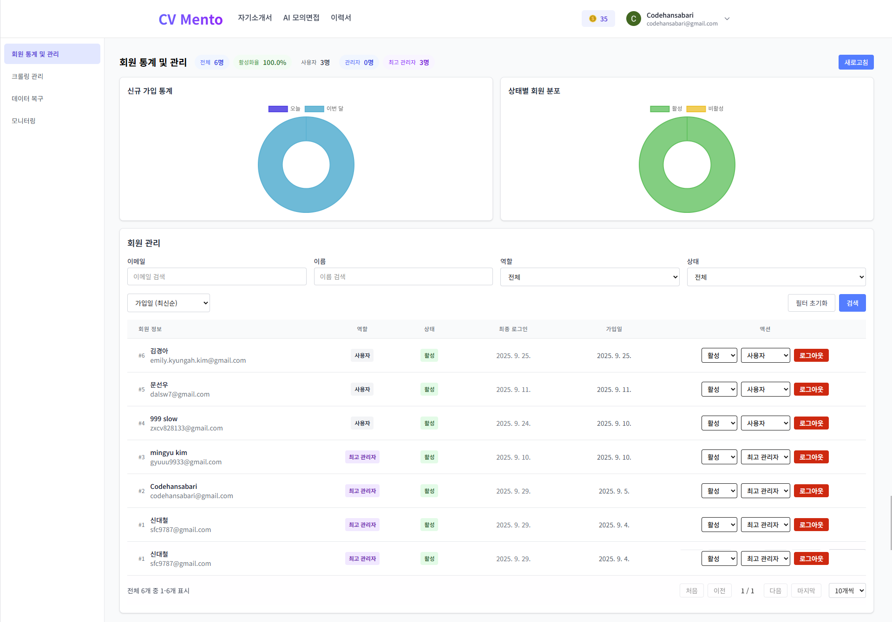
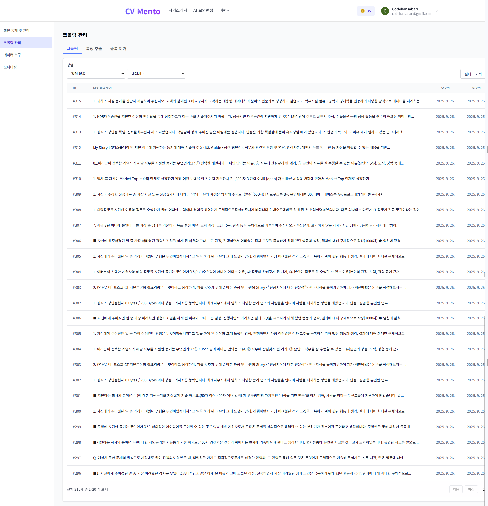
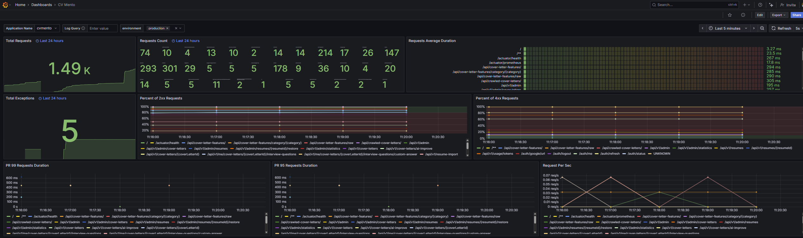

# CVMento 🚀

> AI 기반 자기소개서·이력서 첨삭 및 면접 준비 플랫폼

합격 자소서 데이터를 학습한 AI가 개인화된 첨삭과 면접 준비를 원스톱으로 지원하는 취업 준비생을 위한 웹 서비스입니다.

---

## 📱 서비스 화면

### 메인 페이지

*AI 기반 자동 분석부터 맞춤형 예상질문까지 원스톱 취업 준비 서비스*

### 자기소개서 첨삭

*AI가 제공하는 상세한 피드백과 커스텀 프롬프트 기능*

### AI 모의면접

*자기소개서 기반 예상 질문 생성 및 대화형 면접 체험*

### 이력서 편집

*PDF/이미지 업로드 후 바로 편집 가능한 이력서 관리*

### 관리자 대시보드

*사용자 관리 및 크롤링 데이터 관리*

### 크롤링 대시보드

* 잘쓴 자소서 크롤링부터 특징 추출까지의 데이터*

### 실시간 모니터링

*Grafana Cloud를 통한 실시간 성능 모니터링*

---

## 🌟 주요 기능

### 📝 AI 자기소개서 첨삭
- 합격 자소서 패턴을 학습한 AI의 맞춤형 피드백
- **사용자 커스텀 프롬프트** 지원으로 원하는 방향의 첨삭 가능

### 📄 이력서 업로드 & 편집
- PDF/이미지 파일을 텍스트로 변환하여 바로 편집 가능

### 🎯 AI 모의 면접
- 자기소개서 기반 예상 질문 생성 및 모범 답안 제시
- **대화형 면접**: 사용자가 면접관이 되어 추가 질문 시 자소서 기반 모범답안 실시간 생성

### 🔐 OAuth2 소셜 로그인
- Google 계정으로 간편 로그인

### 📊 관리자 대시보드
- 크롤링 데이터 및 사용자 관리

---

## 🔗 서비스 링크

| 서비스 | URL |
|--------|-----|
| 🌐 **메인 사이트** | https://cvmento.shop |
| 📖 **API 문서** | https://api.cvmento.shop/swagger-ui/index.html |

---

## 🛠 기술 스택

### Backend
```
Java 17 + Spring Boot 3.5
Spring Security + JWT (Access/Refresh Token)
JPA + QueryDSL + MySQL
Redis (세션 관리 + 캐시)
OpenFeign (마이크로서비스 통신)
```

### AI & 외부 API
```
OpenAI GPT + Google Gemini
DJL (임베딩 모델)
```

### 인프라 & 모니터링
```
AWS Elastic Beanstalk + RDS + EC2
Grafana Cloud (모니터링)
Prometheus (메트릭 수집)
GitHub Actions (CI/CD)
```

---

## 🔧 시스템 아키텍처

<!-- 아키텍처 다이어그램이 여기에 추가될 예정입니다 -->

---

## 🚦 빠른 시작

### 📋 필요 환경
```
Java 17+
MySQL 8.0+
Redis
Gradle 7.0+
```

### 🔧 환경 변수 설정
```bash
# Database
DATABASE_URL=jdbc:mysql://localhost:3306/cvmento
DATABASE_USERNAME=your_username
DATABASE_PASSWORD=your_password

# Redis
REDIS_HOST=localhost
REDIS_PORT=6379
REDIS_PASSWORD=your_redis_password

# JWT
JWT_SECRET=your_jwt_secret_key

# OAuth2 (Google)
GOOGLE_CLIENT_ID=your_google_client_id
GOOGLE_CLIENT_SECRET=your_google_client_secret

# AI API Keys
LLM_COVER_LETTER_KEY=your_openai_api_key
LLM_INTERVIEW_KEY=your_openai_api_key
LLM_RESUME_KEY=your_openai_api_key

# Internal API
APP_INTERNAL_KEY=your_internal_api_key
SUB_API_KEY=your_sub_backend_api_key
```

### 🚀 실행 방법

#### 로컬 개발환경 (Docker 사용)
```bash
# 1. 저장소 클론
git clone https://github.com/prgrms-aibe-devcourse/AIBE2_FinalProject_CodeHansabari_BE.git
cd AIBE2_FinalProject_CodeHansabari_BE

# 2. 환경변수 파일 생성
cp .env.example .env
# .env 파일에 필요한 환경변수 설정

# 3. Docker 컨테이너 실행 (MySQL, Redis, Grafana Agent)
docker-compose up -d

# 4. 애플리케이션 빌드 및 실행
cd CVMento
./gradlew clean build
./gradlew bootRun
```

#### 직접 실행
```bash
# MySQL, Redis가 이미 설치되어 있는 경우
./gradlew bootRun --args='--spring.profiles.active=production'
```

---

## 🏗 프로젝트 구조

```
CVMento/
├── src/main/java/com/cvmento/
│   ├── auth/          # 인증/인가 (JWT, OAuth2)
│   ├── resume/        # 이력서 관리
│   ├── coverletter/   # 자기소개서 첨삭
│   ├── interview/     # AI 면접 기능
│   ├── admin/         # 관리자 기능
│   └── common/        # 공통 유틸리티
├── .ebextensions/     # AWS EB 설정
├── agent-production.yml
└── build.gradle
```

---

## 📊 모니터링

- **Grafana Cloud**에서 실시간 모니터링 대시보드 제공

---

## 🤝 팀 구성

| 이름 | 역할 | 담당 업무 |
|------|------|-----------|
| **이인성** | 팀장 | 프론트엔드 + 이력서 기능 개발 |
| **김민규** | 백엔드 | 크롤링 및 데이터 가공 |
| **문선우** | 백엔드 | 자소서 첨삭 + AI 면접 기능 |
| **이동현** | 백엔드 | 관리자 페이지 + 회원 관리 |

---

💡 **CVMento**는 프로그래머스 AI 백엔드 데브코스 2기 최종 프로젝트입니다.
